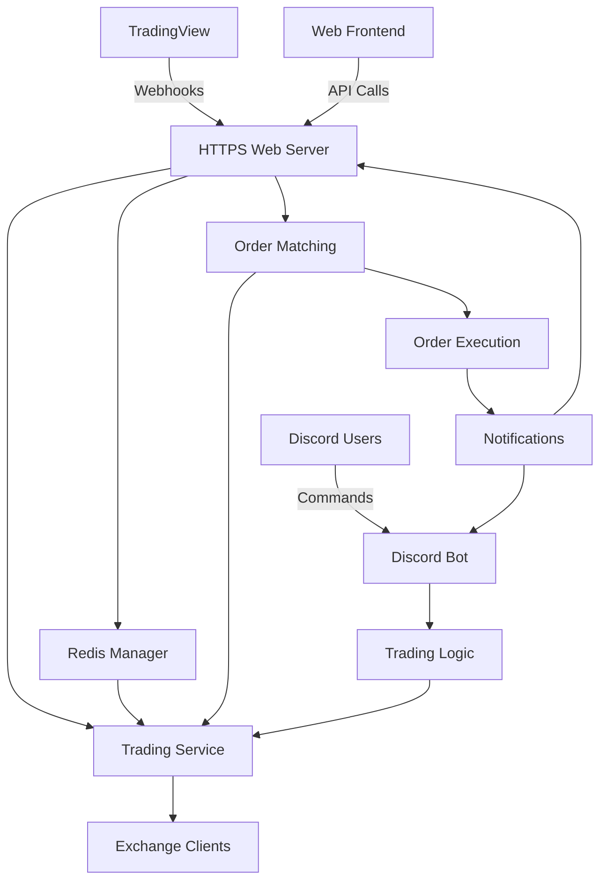

# Professional Discord Trading Bot & HTTPS Trading Server

[](https://python.org)
[](LICENSE)
[](https://github.com/ReinaMacCredy/trading_bot)

## 📋 Quick Status

**🎯 Current Focus**: **IMPLEMENT Mode - Testing Phase Execution Starting**

✅ **Level 3 Planning Phase**: COMPLETE - Comprehensive 6-week implementation roadmap ready  
🚀 **Phase 5: Testing & Validation** (Weeks 1-2) - **STARTING NOW**  
⏳ **Phase 6: Production Deployment** (Weeks 3-4) - PLANNED  
⏳ **Phase 7: Security & Optimization** (Weeks 5-6) - PLANNED  

**Implementation Roadmap Progress**: Week 1 testing infrastructure development with clear deliverables and success metrics

## Overview

A comprehensive professional-grade Discord bot with integrated HTTPS trading server that generates and displays cryptocurrency trading signals in standardized formats. The platform provides advanced technical analysis, real-time market data integration, sophisticated risk management, and automated trading capabilities for traders and trading communities.

## 🚀 Key Features

### **🌐 Dual Interface Architecture**
- **Discord Bot**: Community interaction with slash commands and professional signal formatting
- **HTTPS Trading Server**: TradingView webhook integration with automated order processing
- **Microservices Pattern**: Independent services with shared trading infrastructure

### **📡 TradingView Integration**
- **Webhook Processing**: Real-time TradingView alert reception and validation
- **Order Matching**: Intelligent background matching of orders against incoming signals
- **Redis Queue Management**: Persistent order storage with multi-state processing
- **RESTful API**: Complete order management with status tracking and cancellation

### **💹 Professional Trading Features**
- **Multi-Exchange Support**: Binance, Coinbase, Kraken, Bybit integration via CCXT
- **Real-time Market Data**: Live price feeds and technical analysis
- **Signal Generation**: Professional SC01/SC02 format with live data
- **Risk Management**: Dynamic position sizing and automated TP/SL
- **Technical Analysis**: 10+ indicators (RSI, MACD, EMA, Bollinger Bands, ATR)

### **🤖 Discord Bot Features**
- **Modern Slash Commands**: `/price`, `/signal`, `/stats`, `/help` with auto-completion
- **Professional Help System**: 2-page categorized command reference
- **Order History Tracking**: `/orders` command with rich embed formatting
- **Command Analytics**: Active/inactive command monitoring
- **Real-time Health Monitoring**: Intelligent port selection and error recovery

## 📚 Documentation

### **📖 Main Documentation** (`doc/`)
- **English**: Complete setup, usage, and API documentation
- **Vietnamese**: Comprehensive bilingual support for local communities

### **🌐 Web Server Documentation** (`docs/`)
- **WEB_SERVER.md**: Complete HTTPS server implementation guide
- **API Reference**: FastAPI integration and webhook processing
- **Deployment Instructions**: Production-ready configuration guides

### **🧠 Memory Bank** (`memory-bank/`)
- **Project Context**: Comprehensive project documentation and progress tracking
- **System Patterns**: Architecture documentation and design patterns
- **Technical Context**: Technology stack and configuration guides

## 🚀 Quick Start

### 1. Installation
```bash
# Clone repository
git clone https://github.com/ReinaMacCredy/trading_bot.git
cd trading_bot

# Setup environment
python3 -m venv venv
source venv/bin/activate  # Linux/Mac
# venv\Scripts\activate   # Windows

# Install dependencies
pip install -r requirements.txt
```

### 2. Configuration
```bash
# Copy configuration templates
cp config/env.example .env
cp config/config.yaml.example config/config.yaml

# Edit .env with your credentials:
# - DISCORD_TOKEN=your_discord_bot_token
# - BINANCE_API_KEY=your_binance_api_key
# - BINANCE_SECRET=your_binance_secret
```

### 3. Run Discord Bot
```bash
# Development mode
python main.py

# Production mode with health monitoring
ENVIRONMENT=production python main.py
```

### 4. Run HTTPS Trading Server (Optional)
```bash
# Setup Redis (required for web server)
docker run -d -p 6379:6379 --name redis redis:7-alpine

# HTTP mode (development)
python web_server.py --host 0.0.0.0 --port 8000

# HTTPS mode (production)
python web_server.py --host 0.0.0.0 --port 8000 \
  --ssl-cert /path/to/cert.pem \
  --ssl-key /path/to/key.pem
```

### 5. Verification
```bash
# Test Discord bot
# Use command: b!help in your Discord server
# Note: All bot commands use the 'b!' prefix

# Test web server health
curl http://localhost:8000/status/health

# View API documentation
# Open browser to http://localhost:8000/docs
```

## 📊 Core Commands

### **Discord Commands**
- `b!price <symbol> [exchange]` - Real-time cryptocurrency prices with market data
- `b!signal <symbol> [strategy] [timeframe]` - Professional trading signal generation  
- `b!health` - Comprehensive bot statistics and system status
- `b!help` - Modern help system with feature overview
- `b!orders` - Display recent order history with rich formatting
- `b!actcmd` - Show commands that have been used
- `b!cmdsta` - Show all commands grouped by active/inactive status

### **Web API Endpoints**
- `POST /orders/create` - Create new trading order
- `GET /orders/status/{order_id}` - Get order status  
- `POST /webhooks/tradingview` - TradingView webhook endpoint
- `GET /status/health` - System health check
- `GET /docs` - Interactive API documentation

## 🏗️ Architecture



## 📈 6-Week Implementation Roadmap

### **Phase 5: Testing & Validation** (Weeks 1-2) - 🚀 **CURRENT**
- **Week 1**: Unit test suite development, Redis service testing, API endpoint validation
- **Week 2**: Integration testing framework, performance testing setup, end-to-end validation
- **Success Criteria**: >95% test coverage, <100ms webhook processing, 100% integration success

### **Phase 6: Production Deployment** (Weeks 3-4) - ⏳ **PLANNED**
- **Week 3**: SSL certificate configuration, Redis production setup, environment management
- **Week 4**: Monitoring implementation, deployment automation, health checks
- **Success Criteria**: 99.9% uptime target, comprehensive monitoring, automated deployment

### **Phase 7: Security & Optimization** (Weeks 5-6) - ⏳ **PLANNED**
- **Week 5**: Webhook verification, API authentication, rate limiting implementation
- **Week 6**: Performance optimization, security testing, production readiness validation
- **Success Criteria**: Security audit passed, performance targets met, production validated

## 🚀 Deployment Options

### **Local Development**
```bash
python main.py
```

### **VPS Deployment (cfp.io.vn)**
```bash
# Copy and configure systemd service
sudo cp deployment/trading-bot.service /etc/systemd/system/
sudo systemctl enable trading-bot
sudo systemctl start trading-bot
```

### **Docker Deployment**
```bash
# Development
docker-compose -f deployment/docker-compose.yml up

# Production
docker-compose -f deployment/docker-compose.prod.yml up -d

# VPS Optimized
docker-compose -f deployment/docker-compose.vps.yml up -d
```

### **Heroku Deployment**
```bash
# One-click deployment
heroku create your-trading-bot
git push heroku main
```

## 🛡️ Security Features

- **Webhook Verification**: TradingView signature validation
- **Rate Limiting**: API and command cooldowns
- **Sandbox Mode**: Safe testing environment
- **Error Recovery**: Graceful degradation and fallback
- **Health Monitoring**: Comprehensive system status tracking

## 📊 Technical Specifications

- **Python Version**: 3.11.6
- **Discord Integration**: discord.py with slash commands
- **Exchange APIs**: CCXT multi-exchange support
- **Web Framework**: FastAPI with automatic documentation
- **Database**: Redis for queuing, SQLite/PostgreSQL for storage
- **Deployment**: Docker, systemd, cloud platforms

## 🤝 Contributing

1. Fork the repository
2. Create a feature branch (`git checkout -b feature/amazing-feature`)
3. Commit changes (`git commit -m 'Add amazing feature'`)
4. Push to branch (`git push origin feature/amazing-feature`)
5. Open a Pull Request

## 📄 License

This project is licensed under the MIT License - see the [LICENSE](LICENSE) file for details.

## 🆘 Support

- **Documentation**: `/doc/en/` and `/doc/vi/` for comprehensive guides
- **Issues**: [GitHub Issues](https://github.com/ReinaMacCredy/trading_bot/issues)
- **Discussions**: [GitHub Discussions](https://github.com/ReinaMacCredy/trading_bot/discussions)

## 🎯 Success Metrics

✅ **Production Ready**: 100% startup success rate  
✅ **Performance**: <1 second signal generation  
✅ **Reliability**: Intelligent error recovery and health monitoring  
✅ **Integration**: Complete TradingView webhook processing  
✅ **User Experience**: Modern Discord slash commands with professional formatting  

---

**Repository**: https://github.com/ReinaMacCredy/trading_bot  
**Status**: Production Ready with Active Testing Phase Development  
**Last Updated**: Implementation Phase Week 1 - Testing Infrastructure Focus