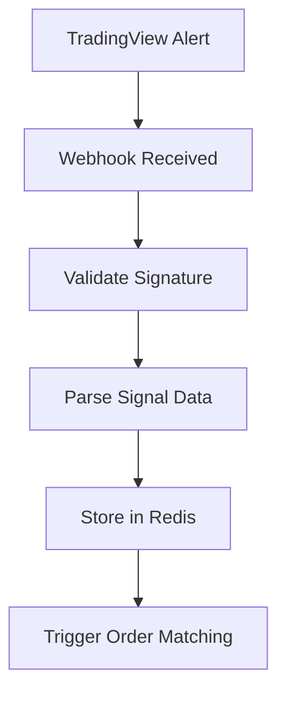
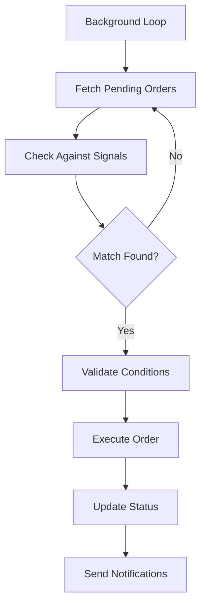

# Trading HTTPS Server

## Overview

The Trading HTTPS Server provides a robust web interface for receiving TradingView webhook signals and managing trading orders through a web frontend. It integrates seamlessly with the existing Discord trading bot infrastructure, creating a comprehensive dual-interface trading platform.

## Architecture

The system follows a microservices pattern with the following components:

```
┌─────────────────┐    ┌─────────────────┐    ┌─────────────────┐
│   TradingView   │───▶│  HTTPS Server   │───▶│   Redis Queue   │
└─────────────────┘    └─────────────────┘    └─────────────────┘
                                │                       │
                                ▼                       ▼
┌─────────────────┐    ┌─────────────────┐    ┌─────────────────┐
│  Web Frontend   │───▶│  Order Matching │───▶│ Trading Service │
└─────────────────┘    └─────────────────┘    └─────────────────┘
                                │                       │
                                ▼                       ▼
┌─────────────────┐    ┌─────────────────┐    ┌─────────────────┐
│  Discord Bot    │◀───│   Notifications │◀───│   Exchange APIs │
└─────────────────┘    └─────────────────┘    └─────────────────┘
```

## Features

### 🌐 HTTPS/HTTP Server
- **FastAPI-based web server** with automatic API documentation
- **SSL/TLS support** for secure communications
- **CORS-enabled** for web frontend integration
- **Health monitoring** and comprehensive status endpoints
- **Production-ready** with comprehensive error handling
- **Async processing** for optimal performance

### 📡 TradingView Integration
- **Webhook endpoint** for real-time TradingView alerts
- **Signal validation** and processing with format checking
- **Support for custom indicators** and multiple strategies
- **Rate limiting** and security features
- **Webhook signature verification** for enhanced security

### 📋 Order Management System
- **Web-based order creation** with full parameter control
- **Redis-powered order queuing** with persistent storage
- **Multi-queue architecture** (pending, matched, executed, failed)
- **Order status tracking** with real-time updates
- **User-specific order management** with history tracking

### 🔄 Intelligent Order Matching
- **Automatic matching** of orders against TradingView signals
- **Conditional execution** based on market conditions
- **Symbol and strategy matching** with intelligent routing
- **Risk management validation** before execution
- **Background processing** with configurable intervals

### 📊 Order Types Support
- **Market Orders**: Immediate execution at current market price
- **Limit Orders**: Price-conditional execution with monitoring
- **Stop Orders**: Stop-loss and take-profit automation
- **Conditional Orders**: Signal-based execution triggers

## Quick Start

### 1. Install Dependencies
```bash
# Install required packages
pip install -r requirements.txt
```

### 2. Configure Redis
```bash
# Option 1: Install locally
sudo apt-get install redis-server  # Ubuntu/Debian
brew install redis                 # macOS

# Option 2: Use Docker (Recommended)
docker run -d -p 6379:6379 --name redis redis:7-alpine

# Start Redis server (if installed locally)
redis-server
```

### 3. Configure Environment
```bash
# Copy example configuration
cp config/web_config.yaml.example config/web_config.yaml

# Set environment variables
export REDIS_HOST=localhost
export REDIS_PORT=6379
export REDIS_PASSWORD=your_redis_password
export TRADINGVIEW_WEBHOOK_SECRET=your_secret_here
export WEB_SERVER_HOST=0.0.0.0
export WEB_SERVER_PORT=8000
```

### 4. Run Server
```bash
# HTTP mode (development)
python web_server.py --host 0.0.0.0 --port 8000

# HTTPS mode (production)
python web_server.py --host 0.0.0.0 --port 8000 \
  --ssl-cert /path/to/cert.pem \
  --ssl-key /path/to/key.pem

# With custom Redis configuration
python web_server.py --host 0.0.0.0 --port 8000 \
  --redis-host localhost --redis-port 6379
```

### 5. Verify Installation
```bash
# Check server health
curl http://localhost:8000/status/health

# Check Redis connection
curl http://localhost:8000/status/redis

# View API documentation
# Open browser to http://localhost:8000/docs
```

## API Endpoints

### 🔐 Health & Status
- **GET /status/health** - Server health check
- **GET /status/redis** - Redis connection status
- **GET /status/trading** - Trading service status
- **GET /status/all** - Comprehensive system status

### 📡 TradingView Webhooks
- **POST /webhooks/tradingview** - Receive TradingView alerts
  - Validates webhook signature
  - Processes signal data
  - Triggers order matching

### 📋 Order Management
- **POST /orders/create** - Create new order
- **GET /orders/status/{order_id}** - Get order status
- **PUT /orders/cancel/{order_id}** - Cancel pending order
- **GET /orders/user/{user_id}** - Get user orders
- **GET /orders/queue/stats** - Queue statistics

### 📊 Queue Management
- **GET /orders/queue/pending** - View pending orders
- **GET /orders/queue/matched** - View matched orders
- **GET /orders/queue/executed** - View executed orders
- **GET /orders/queue/failed** - View failed orders

## Configuration

### Web Server Configuration (config/web_config.yaml)
```yaml
web_server:
  host: "0.0.0.0"
  port: 8000
  ssl_certfile: null  # Path to SSL certificate
  ssl_keyfile: null   # Path to SSL private key
  cors_origins:
    - "http://localhost:3000"
    - "https://yourdomain.com"

redis:
  host: "localhost"
  port: 6379
  password: null
  db: 0
  socket_timeout: 5
  connection_pool_size: 10

tradingview:
  webhook_secret: null  # Set via TRADINGVIEW_WEBHOOK_SECRET
  allowed_strategies: 
    - "MACD_RSI"
    - "EMA_CROSSOVER"
    - "CUSTOM_STRATEGY"
  rate_limit:
    max_requests: 100
    time_window: 3600  # 1 hour

order_matching:
  loop_interval: 1.0      # Check interval in seconds
  batch_size: 50          # Orders processed per batch
  max_execution_time: 30  # Max execution time per order
  retry_attempts: 3       # Retry failed orders
```

### Environment Variables
```bash
# Web Server Configuration
WEB_SERVER_HOST=0.0.0.0
WEB_SERVER_PORT=8000
SSL_CERTFILE=/path/to/cert.pem
SSL_KEYFILE=/path/to/key.pem

# Redis Configuration
REDIS_HOST=localhost
REDIS_PORT=6379
REDIS_PASSWORD=your_password
REDIS_DB=0

# TradingView Integration
TRADINGVIEW_WEBHOOK_SECRET=your_webhook_secret

# Trading Configuration
EXCHANGE_API_KEY=your_api_key
EXCHANGE_SECRET=your_secret
ENABLE_PAPER_TRADING=false
```

## Order Flow

### 1. TradingView Signal Processing


### 2. Order Matching Process


## Order Management

### Creating Orders
```python
# Example order creation
order_data = {
    "user_id": "user123",
    "symbol": "BTCUSDT",
    "side": "buy",
    "order_type": "limit",
    "quantity": 0.001,
    "price": 50000,
    "strategy": "MACD_RSI",
    "conditions": {
        "signal_strength": "strong",
        "timeframe": "1h"
    }
}

response = requests.post(
    "http://localhost:8000/orders/create",
    json=order_data
)
```

### Order States
- **pending**: Order created, waiting for conditions
- **matched**: Matched against signal, awaiting execution
- **executed**: Successfully executed on exchange
- **failed**: Execution failed or cancelled
- **cancelled**: Manually cancelled by user

## Integration with Discord Bot

The web server integrates seamlessly with the Discord bot through:

### Shared Trading Infrastructure
- **Common exchange clients** for unified market access
- **Shared configuration system** for consistent settings
- **Unified risk management** across both interfaces
- **Common notification system** for trade updates

### Data Synchronization
- **Redis-based communication** for real-time data sharing
- **Order status updates** reflected in Discord notifications
- **Signal history** accessible from both interfaces
- **User preferences** synchronized across platforms

## Production Deployment

### Docker Deployment
```bash
# Navigate to deployment directory
cd deployment

# Start web server with Redis
docker compose -f docker-compose.web.yml up -d

# Or full stack with Discord bot
docker compose -f docker-compose.prod.yml up -d
```

### VPS Deployment
```bash
# Clone repository
git clone https://github.com/ReinaMacCredy/trading_bot.git
cd trading_bot

# Setup environment
python -m venv venv
source venv/bin/activate
pip install -r requirements.txt

# Configure services
cp config/web_config.yaml.example config/web_config.yaml
# Edit configuration files

# Start Redis
sudo systemctl start redis

# Start web server
python web_server.py --host 0.0.0.0 --port 8000
```

### SSL Certificate Setup
```bash
# Using Let's Encrypt (recommended)
sudo apt-get install certbot
sudo certbot certonly --standalone -d yourdomain.com

# Use certificates
python web_server.py \
  --ssl-cert /etc/letsencrypt/live/yourdomain.com/fullchain.pem \
  --ssl-key /etc/letsencrypt/live/yourdomain.com/privkey.pem
```

## Monitoring & Maintenance

### Health Monitoring
```bash
# Check all services
curl http://localhost:8000/status/all

# Monitor Redis
redis-cli ping

# Check order queues
curl http://localhost:8000/orders/queue/stats
```

### Log Files
- **Web server logs**: `logs/web_server.log`
- **Order matching logs**: `logs/order_matching.log`
- **Redis logs**: System Redis logs
- **Trading logs**: `logs/trading.log`

### Performance Metrics
- **Order processing time**: Average time from signal to execution
- **Queue depth**: Number of pending orders
- **Success rate**: Percentage of successful order executions
- **Error rate**: Failed orders and webhook errors

## Troubleshooting

### Common Issues

#### Redis Connection Error
```bash
# Check Redis status
redis-cli ping

# Restart Redis
sudo systemctl restart redis

# Check firewall
sudo ufw allow 6379
```

#### SSL Certificate Issues
```bash
# Verify certificate
openssl x509 -in cert.pem -text -noout

# Check key matching
openssl rsa -in key.pem -check
```

#### Webhook Not Receiving
- Verify TradingView webhook URL
- Check firewall settings (port 8000)
- Validate webhook secret configuration
- Review server logs for errors

### Performance Optimization
- **Redis memory optimization**: Use appropriate Redis configuration
- **Order batch processing**: Adjust batch_size in configuration
- **Connection pooling**: Configure Redis connection pool
- **Rate limiting**: Implement appropriate rate limits

## Security Considerations

### Webhook Security
- **Signature verification** for TradingView webhooks
- **HTTPS enforcement** for production deployments
- **Rate limiting** to prevent abuse
- **Input validation** for all API endpoints

### Data Protection
- **Redis AUTH** for database security
- **Environment variables** for sensitive configuration
- **API key encryption** in storage
- **Access logging** for audit trails

---

**The HTTPS Trading Server provides a professional-grade web interface that complements the Discord bot, enabling automated trading through TradingView integration while maintaining the same high standards of security and reliability.** 🚀