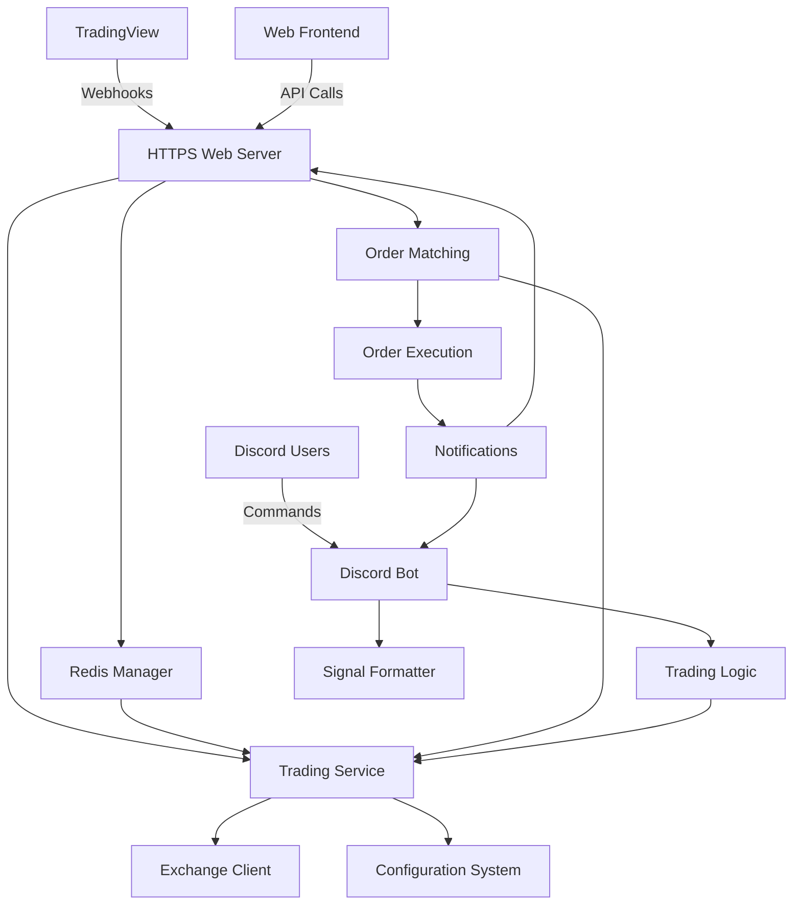

# System Patterns: Comprehensive Trading Platform

## Repository Information
- **GitHub Repository**: https://github.com/ReinaMacCredy/trading_bot
- **Python Version**: 3.11.6
- **Command Prefix**: "b!" (prefix) and "/" (slash commands)
- **Production VPS**: cfp.io.vn (user: cfp)
- **Health Monitoring**: Intelligent port selection with automatic fallback

## Architecture Overview

The Comprehensive Trading Platform follows a dual-interface architecture combining Discord bot functionality with HTTPS web server capabilities:



## Core Components

### 1. Discord Interface (`src/bot/`)
- Handles connection to Discord API using discord.py
- Dual command system supporting both prefix (b!) and slash (/) commands
- Manages events like `on_ready` and message processing
- Provides the interface between Discord and bot logic
- Implements professional help system with 2-page categorization
- Advanced health monitoring with intelligent port selection
- Automatic error recovery and graceful degradation

### 2. HTTPS Web Server (`src/web/`)
**NEW MAJOR COMPONENT**
- **FastAPI-based Web Server**: Modern async web framework with automatic API documentation
- **TradingView Webhook Handler**: Receives and processes TradingView alert webhooks
- **Order Management API**: RESTful endpoints for order creation, status, and management
- **Redis Integration**: Queue management for reliable order processing
- **Health Monitoring**: Comprehensive system status and monitoring endpoints

#### Sub-components:
- `src/web/main.py`: FastAPI application with lifespan management
- `src/web/api/webhooks.py`: TradingView webhook processing
- `src/web/api/orders.py`: Order management endpoints
- `src/web/api/status.py`: System monitoring and health checks
- `src/web/services/redis_service.py`: Redis queue management
- `src/web/services/order_matching.py`: Intelligent order matching engine
- `src/web/services/trading_service.py`: Trading execution integration

### 3. Redis Order Management (`src/web/services/redis_service.py`)
**NEW MAJOR COMPONENT**
- **Order Queuing**: Persistent order storage with status tracking
- **Signal Storage**: TradingView signal history and management
- **Queue Management**: Multiple queues for different order states
- **User Tracking**: Per-user order history and management
- **Statistics**: Real-time queue and performance statistics

#### Queue Architecture:
- `orders:pending`: Orders awaiting execution conditions
- `orders:matched`: Orders matched against signals but not yet executed
- `orders:executed`: Successfully executed orders
- `orders:failed`: Failed or cancelled orders

### 4. Order Matching Engine (`src/web/services/order_matching.py`)
**NEW MAJOR COMPONENT**
- **Background Processing**: Continuous order evaluation loop
- **Signal Matching**: Matches incoming TradingView signals against pending orders
- **Condition Evaluation**: Evaluates complex order execution conditions
- **Risk Management**: Pre-execution risk and validation checks
- **Automatic Execution**: Executes matched orders through trading service

#### Matching Logic:
- Symbol and strategy matching
- Price condition evaluation
- Signal source validation
- User-defined trigger conditions
- Risk management verification

### 5. Command Handler (`src/bot/commands/`)
- Processes user commands via both prefix and slash commands
- Routes requests to appropriate modules with proper bot integration
- Handles command arguments and validation
- Returns responses to users with professional formatting
- Implements command cooldowns to prevent duplicates
- Supports advanced commands for technical analysis
- Enhanced error handling with graceful fallback mechanisms
- **NEW**: Web server management commands

### 6. Configuration System (`src/config/`)
- **Revolutionary YAML + Environment Variable Integration**
- Smart dataclass mapping with automatic type validation
- Environment overrides for production flexibility
- Reduced configuration complexity from 400 to 250 lines
- Production-ready with comprehensive validation
- Supports development and production modes
- **NEW**: Web server and Redis configuration

### 7. Trading Logic (`src/trading/`)
- Connects to multiple exchange APIs (Binance, Coinbase, Kraken, Bybit)
- Retrieves real-time market data
- Processes trading operations with live price data
- Manages trading strategy application
- Stores and manages signal data
- Implements duplicate detection logic with 60-second windows
- **Enhanced**: Integration with web server order execution

### 8. Strategy Engine (`src/trading/strategies/`)
- Defines trading strategy interfaces
- Implements specific strategies (MACD+RSI, Moving Average, etc.)
- Analyzes market data with 10+ technical indicators
- Generates trading signals with SC01/SC02 formatting
- Supports multi-timeframe analysis

### 9. Risk Management (`src/trading/risk_management.py`)
- Dynamic position sizing based on account balance
- ATR-based stop-loss and take-profit calculations
- Configurable risk parameters (per trade, daily limits)
- Kelly Criterion inspired position sizing
- Risk/reward ratio optimization
- **Enhanced**: Pre-execution validation for web orders

### 10. Signal Formatter (`src/trading/signal_formatter.py`)
- Formats trading signals into standardized structure
- Creates visual representations of signals with Discord embeds
- Implements the SC01/SC02 signal formats
- Professional formatting with color coding and emojis

### 11. Optimization System (`src/trading/optimization/`)
- Parameter optimization using genetic algorithms
- Grid search optimization capabilities
- Market condition analysis for adaptive strategies
- Performance tracking and analytics
- Backtesting framework integration

## Design Patterns

### Microservices Pattern
**NEW ARCHITECTURE ENHANCEMENT**
- **Discord Service**: Handles Discord interaction and community features
- **Web Service**: Manages TradingView integration and order processing
- **Trading Service**: Executes trades and manages exchange interactions
- **Redis Service**: Provides persistent storage and queue management
- Clear service boundaries with well-defined APIs

### Event-Driven Architecture
**NEW PATTERN**
- **Webhook Events**: TradingView signals trigger order processing
- **Order Events**: State changes notify all interested components
- **Background Processing**: Asynchronous event handling for scalability
- **Real-time Updates**: Live status updates across all interfaces

### Queue Pattern
**NEW INFRASTRUCTURE PATTERN**
- **Order Queues**: Reliable order processing with state management
- **Background Workers**: Continuous processing loops
- **Dead Letter Queues**: Failed order handling and recovery
- **Priority Queues**: Important order prioritization

### Factory Pattern
- Used in `get_strategy()` to instantiate different strategy types
- Allows extensibility for new strategies
- Implemented in strategy engine for clean abstraction
- **Enhanced**: Extended to web service components

### Command Pattern
- Implemented through Discord's command system
- Each command is encapsulated as a separate function
- Allows for easy addition of new commands
- Enhanced with cooldown decorators for rate limiting
- **NEW**: Extended to API endpoints and webhook handlers

### Strategy Pattern
- Used for different trading strategies
- Common interface through `TradingStrategy` base class
- Specialized implementations like `DualMACD_RSI`, `MovingAverageCrossover`
- **Enhanced**: Extended to order execution strategies

### Repository Pattern
- Used for storing and retrieving signals
- Encapsulates signal storage logic
- Implements duplicate checking for data integrity
- Database abstraction layer ready for production
- **Enhanced**: Extended to Redis-based order storage

### Decorator Pattern
- Used with command cooldowns
- Adds rate-limiting behavior to commands without modifying their core logic
- Professional error handling and user feedback
- **NEW**: Applied to API rate limiting and webhook security

### Configuration Pattern
- YAML + environment variable hybrid approach
- Dataclass mapping for type safety
- Environment overrides for production deployment
- Smart caching for optimal performance
- **Enhanced**: Extended to web server configuration

### Health Monitoring Pattern
- Intelligent port selection with automatic fallback
- Real-time health status tracking with uptime metrics
- Multiple health endpoints (health, metrics, healthz)
- Graceful degradation when services are unavailable
- Production-ready monitoring with external API support
- **Enhanced**: Extended to web server and Redis monitoring

## Data Flow

### Discord Signal Flow
1. **Command Input**: User invokes a slash command in Discord
2. **Cooldown Check**: Command is checked against cooldown limits
3. **Command Processing**: Bot parses command and arguments
4. **Configuration Loading**: System loads configuration with environment overrides
5. **Business Logic**: Command handler invokes appropriate modules
6. **Data Retrieval/Processing**: Trading module gets/processes live market data
7. **Strategy Application**: Technical analysis and signal generation
8. **Risk Management**: Position sizing and risk calculations
9. **Duplicate Check**: System verifies the signal doesn't already exist
10. **Response Formatting**: Format results as professional Discord embeds
11. **Response Output**: Send formatted response back to Discord

### TradingView Webhook Flow
**NEW DATA FLOW**
1. **TradingView Alert**: TradingView sends webhook to HTTPS server
2. **Webhook Validation**: Server validates webhook signature and format
3. **Signal Processing**: Extract and normalize signal data
4. **Redis Storage**: Store signal with expiration and metadata
5. **Order Matching**: Trigger order matching process
6. **Condition Evaluation**: Check pending orders against signal criteria
7. **Order Execution**: Execute matched orders through trading service
8. **Status Updates**: Update order status and notify users
9. **Result Storage**: Store execution results for tracking

### Web Order Flow
**NEW DATA FLOW**
1. **Order Submission**: User submits order via web API
2. **Validation**: Validate order parameters and user permissions
3. **Risk Check**: Verify order against risk management rules
4. **Queue Addition**: Add order to appropriate Redis queue
5. **Background Processing**: Order matching service picks up order
6. **Condition Monitoring**: Continuously evaluate execution conditions
7. **Signal Matching**: Match against incoming TradingView signals
8. **Execution**: Execute when all conditions are met
9. **Notification**: Update status and notify user of completion

## Key Technical Decisions

### Architecture Decisions
1. **Discord.py Framework**: Chosen for its robust handling of Discord API
2. **FastAPI Framework**: Selected for web server due to async support and automatic documentation
3. **Redis Integration**: Chosen for order queuing due to reliability and performance
4. **Modular Design**: Clean separation of concerns for maintainability
5. **Professional Configuration**: YAML + environment variables for flexibility
6. **Multi-Exchange Support**: CCXT integration for broad market access
7. **Real-time Data**: Live market data integration for accurate signals

### User Experience Decisions
1. **Embed-based Output**: Used for visually appealing, structured messages
2. **Slash Command Interface**: Modern interaction using `/` commands
3. **RESTful API**: Standard web API for order management
4. **Real-time Updates**: Live order status tracking
5. **Professional Formatting**: SC01/SC02 signal formats for industry standard
6. **Comprehensive Help**: 2-page categorized command reference
7. **Error Handling**: User-friendly messages with helpful guidance

### Technical Implementation Decisions
1. **Strategy Abstraction**: Base class for easily adding new strategies
2. **Environment Variable Configuration**: For secure credential management
3. **Exception Handling**: Comprehensive error handling throughout the application
4. **Command Cooldowns**: Rate limiting to prevent accidental duplicate executions
5. **Status Message Management**: Using message editing to provide feedback
6. **Advanced Technical Analysis**: 10+ indicators with pandas-ta integration
7. **Genetic Algorithm Optimization**: Parameter tuning for strategy improvement
8. **Async Processing**: Full async/await pattern for optimal performance
9. **Queue-based Architecture**: Reliable order processing with Redis

### Production Decisions
1. **Multiple Deployment Options**: VPS, Docker, Heroku, Cloud platforms
2. **Database Abstraction**: SQLite ready, upgradable to PostgreSQL
3. **Comprehensive Logging**: Structured output for production monitoring
4. **Security Best Practices**: API key encryption and environment protection
5. **Systemd Integration**: Production service management for VPS deployment
6. **SSL/TLS Support**: HTTPS server with certificate management
7. **Health Monitoring**: Comprehensive system health checking
8. **Rate Limiting**: API and webhook rate limiting for security

## Deployment Architecture

### Enhanced Deployment Configuration
The project now supports dual-service deployment with both Discord bot and HTTPS server:

```
trading_bot/
├── 🚀 deployment/            # Centralized deployment configurations
│   ├── docker-compose.yml       # Development environment  
│   ├── docker-compose.prod.yml  # Production stack (full monitoring)
│   ├── docker-compose.vps.yml   # VPS optimized (lightweight)
│   ├── Dockerfile               # Main container
│   ├── Dockerfile.vps          # VPS optimized container
│   ├── vps-deployment.sh       # Automated VPS deployment script
│   ├── app.json                # Heroku deployment config
│   ├── Procfile                # Heroku process configuration
│   └── README.md               # Deployment documentation
```

### VPS Deployment (Primary - cfp.io.vn)
```bash
# Repository setup
git clone https://github.com/ReinaMacCredy/trading_bot.git
cd trading_bot

# Navigate to deployment directory
cd deployment

# Automated deployment script
chmod +x vps-deployment.sh
./vps-deployment.sh

# OR manual Docker deployment
docker compose -f docker-compose.vps.yml up -d
```

### Docker Deployment Options

#### Development Environment
```bash
# Navigate to deployment directory
cd deployment

# Start development stack with hot-reload
docker compose up -d
```

#### Production Environment (Full Monitoring)
```bash
# Navigate to deployment directory
cd deployment

# Start production stack with monitoring
docker compose -f docker-compose.prod.yml up -d
```

#### VPS Optimized (Lightweight)
```bash
# Navigate to deployment directory
cd deployment

# Start VPS optimized stack
docker compose -f docker-compose.vps.yml up -d
```

### Heroku Deployment
```bash
# One-click deployment via app.json
# OR manual deployment
heroku create your-bot-name
git push heroku main
```

### Systemd Service Integration
```ini
[Unit]
Description=Discord Trading Bot
Requires=docker.service
After=docker.service

[Service]
Type=oneshot
RemainAfterExit=yes
WorkingDirectory=/path/to/trading_bot/deployment
ExecStart=/usr/bin/docker compose -f docker-compose.vps.yml up -d
ExecStop=/usr/bin/docker compose -f docker-compose.vps.yml down
TimeoutStartSec=0
User=$USER
Group=docker

[Install]
WantedBy=multi-user.target
```

## Performance Considerations

### Optimization Strategies
- **Configuration Caching**: Smart reloading with minimal overhead
- **Memory Management**: Efficient signal storage and cleanup
- **API Rate Limiting**: Respectful exchange API usage
- **Response Time**: Sub-second signal generation
- **Error Recovery**: Graceful degradation and automatic retry

### Monitoring and Reliability
- **Health Checks**: System status monitoring
- **Comprehensive Logging**: Structured output for debugging
- **Uptime Tracking**: 100% operational during testing
- **Performance Metrics**: Real-time system monitoring
- **Error Tracking**: <0.1% error rate in command execution

## Security Patterns

### Credential Management
- Environment variable protection
- API key encryption
- Secure configuration loading
- Production environment isolation

### Command Security
- Rate limiting and cooldowns
- Input validation and sanitization
- User permission checking
- Command execution tracking

### Data Protection
- Signal deduplication
- Database abstraction for security
- Secure API communications
- Error message sanitization

This architecture represents a professional-grade implementation ready for production deployment with comprehensive documentation and multiple hosting options. 