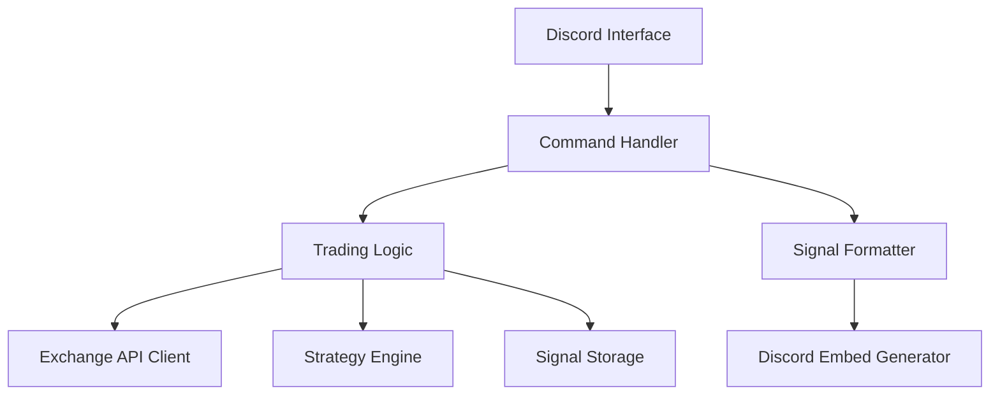

# System Patterns: Discord Trading Signal Bot

## Architecture Overview

The Discord Trading Signal Bot follows a modular architecture with these key components:

## Core Components

### 1. Discord Interface (`bot.py`)
- Handles connection to Discord API
- Defines bot class and basic functionality
- Manages events like `on_ready` and message processing
- Provides the interface between Discord and bot logic

### 2. Command Handler (`main.py`)
- Processes user commands
- Routes requests to appropriate modules
- Handles command arguments and validation
- Returns responses to users
- Implements command cooldowns to prevent duplicates

### 3. Trading Logic (`trading.py`)
- Connects to exchange APIs
- Retrieves market data
- Processes trading operations
- Manages trading strategy application
- Stores and manages signal data
- Implements duplicate detection logic

### 4. Strategy Engine (`strategies.py`)
- Defines trading strategy interfaces
- Implements specific strategies (MA, RSI, etc.)
- Analyzes market data
- Generates trading signals

### 5. Signal Formatter
- Formats trading signals into standardized structure
- Creates visual representations of signals
- Implements the SC01 signal format

## Design Patterns

### Factory Pattern
- Used in `get_strategy()` to instantiate different strategy types
- Allows extensibility for new strategies

### Command Pattern
- Implemented through Discord's command system
- Each command is encapsulated as a separate function
- Allows for easy addition of new commands
- Enhanced with cooldown decorators for rate limiting

### Strategy Pattern
- Used for different trading strategies
- Common interface through `TradingStrategy` base class
- Specialized implementations like `RSIStrategy`, `MovingAverageCrossover`

### Repository Pattern
- Used for storing and retrieving signals
- Encapsulates signal storage logic
- Implements duplicate checking for data integrity

### Decorator Pattern
- Used with command cooldowns
- Adds rate-limiting behavior to commands without modifying their core logic

## Data Flow

1. **Command Input**: User enters command in Discord
2. **Cooldown Check**: Command is checked against cooldown limits
3. **Command Processing**: Bot parses command and arguments
4. **Business Logic**: Command handler invokes appropriate modules
5. **Data Retrieval/Processing**: Trading module gets/processes data
6. **Duplicate Check**: System verifies the signal doesn't already exist
7. **Response Formatting**: Format results as Discord embeds
8. **Response Output**: Send formatted response back to Discord

## Key Technical Decisions

1. **Discord.py Framework**: Chosen for its robust handling of Discord API
2. **Embed-based Output**: Used for visually appealing, structured messages
3. **Strategy Abstraction**: Base class for easily adding new strategies
4. **Environment Variable Configuration**: For secure credential management
5. **Exception Handling**: Comprehensive error handling throughout the application
6. **Command Cooldowns**: Rate limiting to prevent accidental duplicate executions
7. **Status Message Management**: Using message editing to provide feedback without cluttering chat 